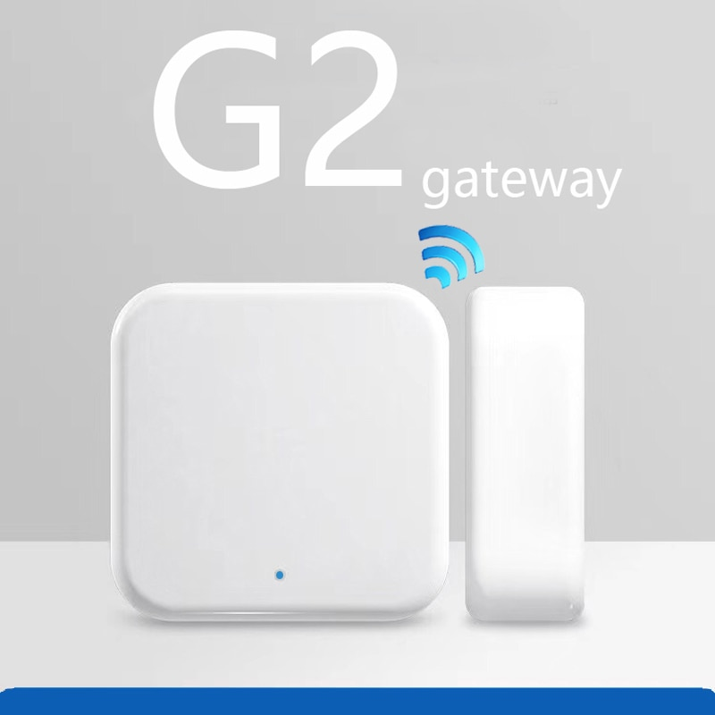

# TTLock2MQTT
> Integrating your TTLocks devices with Home Assistant over MQTT.

![Project Stage][project-stage-shield]![Maintenance][maintenance-shield] 

Enables adding your TTLock devices with Home Assistant over MQTT using [TTLock API][ttlockapi] and the `WiFi G2 Gateway`

  
  

## Configuration

1. Click install.
2. Read the [DOCS](./DOCS.md).

## Release History

* 0.1
    * Work in progress

## Meta
  
Antonio Campos - [tonyldo][github_tonyldo] - tonyldo@gmail.com 
  
Distributed under the Apache-2.0 License. See ``LICENSE`` for more information.

<!-- Markdown link -->
[wiki]: https://github.com/tonyldo/tonyldo-hassio-addons
[project-stage-shield]: https://img.shields.io/badge/project%20stage-development%20beta-red.svg
[maintenance-shield]: https://img.shields.io/maintenance/yes/2020.svg
[ttlockapi]: https://open.ttlock.com/doc/userGuide
[github_tonyldo]: https://github.com/tonyldo/

